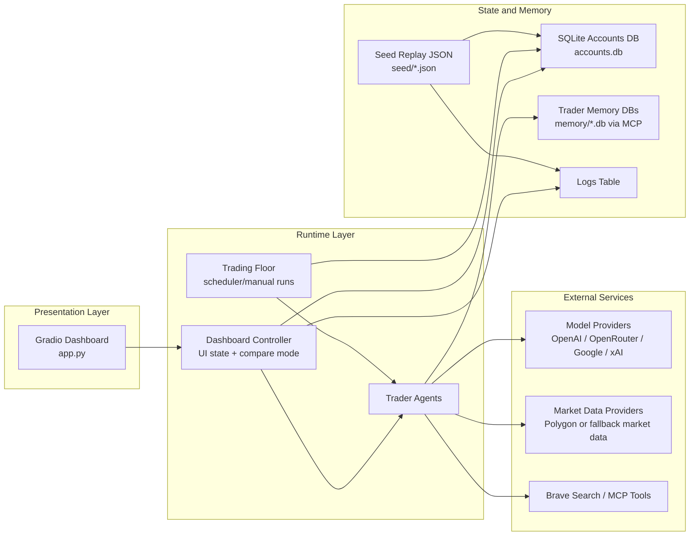
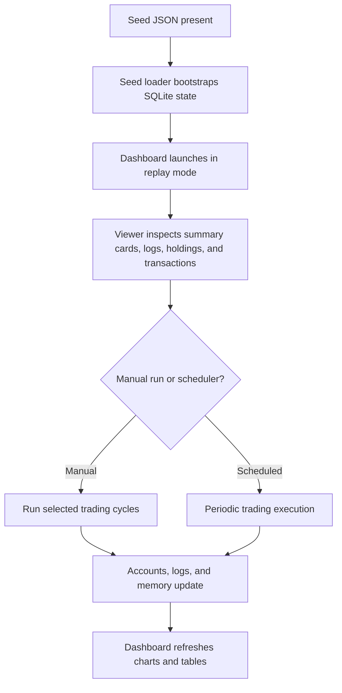

# Autonomous Trading System

Multi-agent trading system with a Gradio dashboard for comparing agent behavior, replaying seeded scenarios, and inspecting portfolio decisions without relying on opaque logs alone.

## Demo

[](https://huggingface.co/spaces/cameronbell/autonomous_trading_system)

Planned visual assets for this repository:

- `media/demo.gif`
- `screenshots/overview.png`
- `screenshots/compare-mode.png`

These placeholders document the intended portfolio presentation. They are not committed yet.

## Overview

This project packages the trading simulation into a portfolio-grade surface that is legible to both recruiters and engineers.

- Stateful Gradio dashboard with summary cards, drill-down panels, and compare mode
- Seeded replay data for reproducible demos
- Optional manual execution mode for controlled agent runs
- Local-path-safe database and memory configuration

The result is a system that can be reviewed as a product experience, not just a pile of local scripts.

## Problem

Autonomous multi-agent systems are difficult to evaluate when the only artifacts are raw logs, ad hoc local runs, and binary runtime state.

- It is hard to compare multiple agents side by side
- Portfolio changes and reasoning get buried inside logs
- Demoing the system repeatedly is unreliable when the state depends on whatever happened last on a local machine
- Hosted presentation is weaker if the repo has no clear visual or architectural narrative

## Solution

This repository solves that by combining a seeded replay model with an inspectable Gradio dashboard and optional controlled execution.

- Seeded JSON snapshots bootstrap repeatable demo state
- The dashboard surfaces trader summaries, detailed holdings, transactions, and logs
- Compare mode makes it easier to evaluate relative behavior across agents
- Manual runs allow the system to move forward deliberately when you want live behavior instead of replay-only inspection

## Architecture

### System Architecture



### Workflow and Data Flow



## Key Features

- Trader summary cards with portfolio value, PnL, and compact history charts
- Single-trader deep dive for logs, holdings, and recent transactions
- Multi-trader comparison with normalized or absolute chart views
- Seed-based demo mode using JSON snapshots instead of committed SQLite binaries as the source of truth
- Optional manual run trigger for advancing the simulation in controlled steps
- Path-safe database and memory configuration for local and hosted execution

## Tech Stack

- Python
- Gradio
- pandas
- Plotly
- SQLite
- python-dotenv
- MCP memory tooling
- Optional market data integrations such as Polygon
- Optional model provider integrations such as OpenAI, OpenRouter, Google, and xAI

## Project Structure

```text
.
├── app.py
├── trading_floor.py
├── traders.py
├── accounts.py
├── database.py
├── mcp_params.py
├── seed_loader.py
├── ui_config.py
├── seed/
│   ├── accounts.seed.json
│   └── logs.seed.json
├── memory/
└── docs/
```

Key files:

- `app.py`: Gradio dashboard and interaction logic
- `trading_floor.py`: trader orchestration and scheduler/manual run entrypoints
- `seed_loader.py`: replay seed bootstrap and reset helpers
- `ui_config.py`: trader names and model configuration
- `database.py`: SQLite pathing and persistence helpers
- `mcp_params.py`: market, search, and memory MCP server configuration

## UI Walkthrough

The dashboard is designed so a reviewer can understand the system in one pass.

- Summary cards provide a fast scan of each trader’s portfolio value, PnL, and recent state
- Active trader view exposes logs, holdings, and transactions for deeper inspection
- Compare mode lets you line up multiple traders and inspect relative performance patterns
- Seeded replay state makes the interface predictable enough for screenshots, demos, and hosted review

Planned visual callouts:

- `screenshots/overview.png`: full dashboard overview with summary cards and detail panel
- `screenshots/compare-mode.png`: compare mode with merged metrics and transactions
- `media/demo.gif`: short hosted demo walkthrough

## What This Demonstrates

This project is intended to demonstrate engineering and product judgment rather than claim fabricated benchmark numbers.

- Reproducible demo setup without depending on committed binary runtime state
- Faster UI-based evaluation of agent behavior than reading raw logs alone
- Easier side-by-side comparison across multiple autonomous traders
- Deployable presentation model suitable for GitHub and Hugging Face Spaces
- Clearer technical communication through architecture, workflow, and docs

## Run Locally

Install dependencies:

```bash
pip install -r requirements.txt
```

Start the dashboard:

```bash
python app.py
```

Useful environment variables:

- `DEMO_MODE=true`
- `SEED_ON_STARTUP=true`
- `SEED_STRATEGY=if_empty`
- `ENABLE_MANUAL_RUN=false`
- `ENABLE_DEMO_RESET=false`
- `USE_MANY_MODELS=false`

To run trader cycles manually from the CLI:

```bash
python trading_floor.py --runs 1
```

## Demo Data

Replay data lives in:

- `seed/accounts.seed.json`
- `seed/logs.seed.json`

On startup, the app can seed the local SQLite database from these files. That keeps the demo reproducible while avoiding committed binary state as the only source of truth.

## Linked Technical Docs

- [Architecture Notes](docs/architecture.md)
- [Design Decisions](docs/design-decisions.md)
- [Evaluation Notes](docs/evaluation.md)
